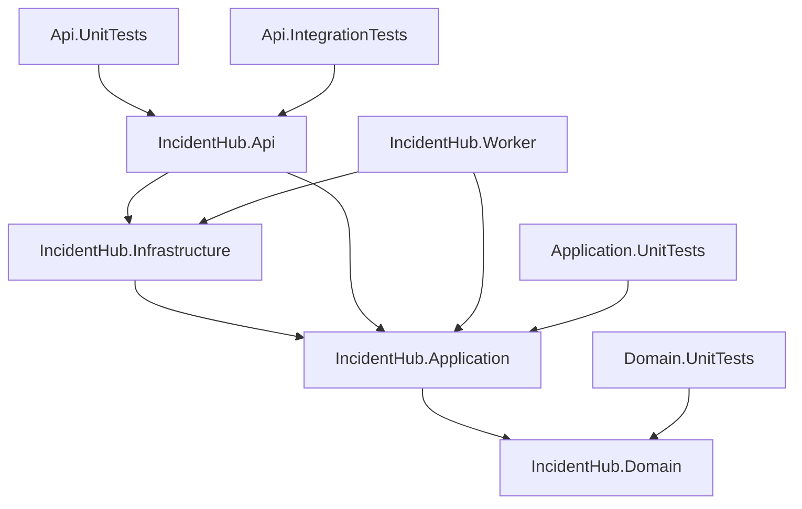

# Spec: IncidentHub solution layout & folder structure

> Status: **Scaffolded** (skeleton builds; no business logic yet). Source of truth for rules and behaviour is [`CLAUDE.md`](../../CLAUDE.md);
> this spec only defines *where things live*. It contains no business logic.

## 1. Purpose & scope

Defines the physical layout of the IncidentHub backend: root files, projects, folders, project references,
NuGet packages per project, and the order in which the skeleton will be scaffolded. Anything about *how*
code behaves (state machine, outbox, SLA, security) is specified in CLAUDE.md and is only referenced here.

## 2. Naming decisions

| Decision | Reason |
|---|---|
| Solution file is `IncidentHub.sln`; the current `SIMD/` template project and `SIMD.sln` are removed when scaffolding starts. | Match the `IncidentHub.*` project names in CLAUDE.md. |
| The monitored-application entity is `MonitoredApp` (folder `Apps/`). FK stays `ApplicationId`, routes stay `/api/v1/applications`. | `Application` would collide with the `IncidentHub.Application` namespace. |
| The SignalR hub class is `IncidentsHub` (route `/hubs/incidents`), typed as `Hub<IIncidentClient>`. | `IncidentHub` would shadow the root namespace. |
| Root namespace of each project = project name; sub-namespace = folder path. | Predictable discovery. |

## 3. Root layout

```
/
├── IncidentHub.sln
├── global.json                    # SDK 8.0.100, rollForward: latestMajor (only SDK 9 installed; builds net8.0)
├── Directory.Build.props          # net8.0, LangVersion 12, Nullable, ImplicitUsings, TreatWarningsAsErrors
├── Directory.Packages.props       # central package versions (ManagePackageVersionsCentrally)
├── .editorconfig                  # file-scoped namespaces, sealed-by-default analyzers, dotnet format rules
├── .gitignore                     # existing (dotnet new gitignore + secrets)
├── docker-compose.yml             # mssql, redis, azurite
├── .config/
│   └── dotnet-tools.json          # dotnet-ef, swashbuckle.aspnetcore.cli
├── contracts/
│   └── swagger.json               # generated OpenAPI spec — frontend TS types are generated from it; CI diffs it
├── docs/
│   └── adr/                       # Architecture Decision Records (0001-*.md)
├── src/
│   ├── IncidentHub.Domain/
│   ├── IncidentHub.Application/
│   ├── IncidentHub.Infrastructure/
│   ├── IncidentHub.Api/
│   └── IncidentHub.Worker/
└── tests/
    ├── IncidentHub.Domain.UnitTests/
    ├── IncidentHub.Application.UnitTests/
    ├── IncidentHub.Api.UnitTests/
    └── IncidentHub.Api.IntegrationTests/
```

## 4. Project dependency graph



| Project | May reference | Must NOT reference |
|---|---|---|
| Domain | nothing (BCL only) | EF Core, ASP.NET Core, MediatR, any other project |
| Application | Domain; MediatR, FluentValidation, `Microsoft.Extensions.*.Abstractions` | EF Core provider packages, ASP.NET Core, Infrastructure |
| Infrastructure | Application (and transitively Domain) | Api, Worker |
| Api | Application, Infrastructure | Worker |
| Worker | Application, Infrastructure | Api |

> Application defines `IAppDbContext` exposing `DbSet<T>`-like access through an abstraction. If `IQueryable`
> projection needs EF async extensions, Application may reference only `Microsoft.EntityFrameworkCore`
> (core, no provider) — this is the single permitted exception and must be recorded in an ADR before use.

## 5. Per-project folder trees

### 5.1 `src/IncidentHub.Domain`

```
Common/          # Entity, AggregateRoot (domain event list), IDomainEvent, Result<T>, Error, DomainException
Incidents/       # Incident (aggregate, TransitionTo), IncidentStatus, Severity, IncidentWorkflow (transition table),
                 # IncidentHistory, Comment, Attachment, ScanStatus, IncidentNumber (value object, "INC-1042")
  Events/        # IncidentReported, IncidentTransitioned, IncidentAssigned, SeverityChanged, CommentAdded, AttachmentAdded
Apps/            # MonitoredApp, AppEnvironment (Production, UAT, Development), AppStatus, AppStatusCalculator
Teams/           # Team, TeamMember (composite key TeamId+UserId, Role)
Sla/             # SlaPolicy, SlaClock (computes AckDueAt / ResolveDueAt)
Users/           # User (Entra oid ↔ internal id), UserRole (Reporter, Responder, TeamLead, Admin), Actor (who performed an action)
Outbox/          # OutboxMessage (Id, Type, Payload, OccurredAt, ProcessedAt, Attempts)
```

### 5.2 `src/IncidentHub.Application`

```
Abstractions/    # IAppDbContext, IFileStore, INotificationSender, IIncidentNotifier, ICurrentUser, IAppTeamReader, IUserDirectory,
                 # IDashboardCache, IDistributedLock, IIdempotencyStore, IHtmlSanitizer
Behaviors/       # ValidationBehavior, LoggingBehavior (MediatR pipeline)
Incidents/
  ReportIncident/        # ReportIncidentCommand, ReportIncidentHandler, ReportIncidentValidator
  TransitionIncident/    # TransitionIncidentCommand, …Handler, …Validator
  AssignIncident/
  ChangeSeverity/
  AddComment/
  AddAttachment/
  GetIncidentByNumber/   # GetIncidentByNumberQuery, …Handler
  ListIncidents/         # ListIncidentsQuery, …Handler, …Validator (paging/filter rules)
  GetIncidentHistory/
  Dtos/                  # IncidentDto, IncidentListItemDto, IncidentHistoryDto, CommentDto, AttachmentDto
Apps/
  ListApps/  GetAppStatus/  Dtos/
Dashboard/
  GetDashboardSummary/   # reads IDashboardCache first, falls back to SQL projection
  Dtos/
DependencyInjection.cs   # AddApplication(): MediatR, validators, behaviors
```

### 5.3 `src/IncidentHub.Infrastructure`

```
Persistence/
  AppDbContext.cs        # implements IAppDbContext
  Configurations/        # one IEntityTypeConfiguration<T> per entity (IncidentConfiguration, …)
  Interceptors/          # OutboxInterceptor (domain events → OutboxMessage in same SaveChanges),
                         # AuditInterceptor (IncidentHistory rows), DomainEventDispatchInterceptor (post-commit)
  Migrations/            # generated by dotnet ef; applied via migration bundle in the pipeline
  Sequences.cs           # IncidentNumber SQL SEQUENCE definition
Caching/                 # RedisDashboardCache, RedisDistributedLock, RedisIdempotencyStore
Storage/                 # BlobFileStore (upload, 5-min SAS links)
Notifications/           # EmailNotificationSender, TeamsNotificationSender, NotificationRouter
Security/                # HtmlSanitizerAdapter (IHtmlSanitizer)
Resilience/              # Polly pipelines per outbound channel (timeout, retry+jitter, circuit breaker)
DependencyInjection.cs   # AddInfrastructure(config)
```

### 5.4 `src/IncidentHub.Api`

```
Program.cs               # host, auth, SignalR + Redis backplane, OpenTelemetry, Swagger, ProblemDetails
Controllers/             # IncidentsController, CommentsController, AttachmentsController,
                         # ApplicationsController, DashboardController  — all under /api/v1, thin
Hubs/                    # IncidentsHub (Hub<IIncidentClient>), IIncidentClient, SignalRIncidentNotifier (IIncidentNotifier)
Auth/                    # Policies (constants + registration), AppTeamRequirement, AppTeamAuthorizationHandler,
                         # CurrentUser (ICurrentUser from claims), group → role mapping
Errors/                  # ProblemDetailsMiddleware (Result/exception → RFC 7807 with traceId)
Filters/                 # IdempotencyFilter (Idempotency-Key), IfMatchFilter (RowVersion ↔ ETag)
Contracts/               # HTTP request models (mapped to commands in controllers)
appsettings.json         # non-secret config only
```

### 5.5 `src/IncidentHub.Worker`

```
Program.cs               # host, OpenTelemetry, AddApplication/AddInfrastructure
Jobs/                    # OutboxDispatcher, SlaMonitor, DailyStatsJob (BackgroundService each)
appsettings.json
```

### 5.6 `tests/`

```
IncidentHub.Domain.UnitTests/         # mirrors Domain folders: Incidents/IncidentWorkflowTests.cs, Sla/SlaClockTests.cs, …
IncidentHub.Application.UnitTests/    # mirrors Application: Incidents/ReportIncident/ReportIncidentHandlerTests.cs, …
IncidentHub.Api.UnitTests/            # fast tests of Api classes that need no host: Auth/GroupRoleClaimsTransformationTests.cs, …
IncidentHub.Api.IntegrationTests/
  Infrastructure/                     # ApiFactory (WebApplicationFactory + Testcontainers), TestAuthHandler, TestJwt, AuthProbeController
  Incidents/  Auth/  Hubs/  Outbox/   # [Trait("Category", "Integration")] on every class
```

## 6. File placement conventions

- **Use cases:** `Application/<Area>/<UseCase>/<UseCase>{Command|Query}.cs`, `<UseCase>Handler.cs`, `<UseCase>Validator.cs`.
- **EF configuration:** `Infrastructure/Persistence/Configurations/<Entity>Configuration.cs`, one per entity.
- **Tests:** `<ClassUnderTest>Tests.cs` in the mirrored folder of the matching test project.
- **Namespaces:** file-scoped, equal to project + folder path (e.g. `IncidentHub.Application.Incidents.ReportIncident`).
- **One public type per file**, file name = type name.

## 7. NuGet packages per project

Versions are pinned centrally in `Directory.Packages.props`. NuGet audit warnings are build errors
(`TreatWarningsAsErrors`), so packages must stay on non-vulnerable versions — e.g. HtmlSanitizer ≥ 9.x
and Microsoft.Identity.Web ≥ 4.x (both still support net8.0).

| Project | Packages |
|---|---|
| Domain | — |
| Application | MediatR, FluentValidation, FluentValidation.DependencyInjectionExtensions, Microsoft.Extensions.Logging.Abstractions |
| Infrastructure | Microsoft.EntityFrameworkCore.SqlServer, StackExchange.Redis, Azure.Storage.Blobs, HtmlSanitizer, Microsoft.Extensions.Http.Resilience |
| Api | Microsoft.Identity.Web, Microsoft.AspNetCore.SignalR.StackExchangeRedis, Swashbuckle.AspNetCore, OpenTelemetry.Extensions.Hosting, OpenTelemetry.Instrumentation.AspNetCore, Microsoft.EntityFrameworkCore.Design |
| Worker | OpenTelemetry.Extensions.Hosting |
| Domain.UnitTests / Application.UnitTests | xunit, xunit.runner.visualstudio, Microsoft.NET.Test.Sdk, FluentAssertions, NSubstitute |
| Api.UnitTests | the above + Microsoft.Extensions.Diagnostics.Testing (`FakeLogger`) |
| Api.IntegrationTests | the above + Microsoft.AspNetCore.Mvc.Testing, Testcontainers.MsSql, Testcontainers.Redis, Microsoft.AspNetCore.SignalR.Client |

## 8. Scaffold order (for later implementation)

1. Remove `SIMD/` and `SIMD.sln`; add root files (`global.json`, `Directory.Build.props`, `Directory.Packages.props`, `.editorconfig`, `docker-compose.yml`).
2. `dotnet new sln -n IncidentHub`; `dotnet new classlib` / `webapi` / `worker` / `xunit` per project; `dotnet sln add`; `dotnet add reference` per §4.
3. Create the folder skeleton and minimal `DependencyInjection.cs` / `Program.cs` wiring so the solution builds.
4. `dotnet new tool-manifest`; install `dotnet-ef` and `swashbuckle.aspnetcore.cli`; create `contracts/` and `docs/adr/`.

## 9. Acceptance checks for the future scaffold

- `dotnet build` succeeds with `TreatWarningsAsErrors`.
- `dotnet test` runs (empty suites pass); `dotnet test --filter Category!=Integration` excludes integration tests.
- `docker compose up -d` starts SQL Server, Redis and Azurite.
- `dotnet run --project src/IncidentHub.Api` serves `/swagger` in Development.
- Domain and Application `.csproj` files contain no EF Core provider or ASP.NET Core references.
